# 🏛️ RWA Compliance — Pipeline IA d’audit réglementaire de White Papers


> **V1 publique, anonymisée — démonstration technique / portfolio.**  
> Ce dépôt **n’est pas** le système de production déployé pour le client. Il exclut volontairement les documents confidentiels, prompts de production, framework réglementaire complet, credentials, détails d’infrastructure, données clients et résultats d’audit.

## ✨ En un coup d’œil

| Repère | Description |
|---|---|
| 🧾 **77 critères** | Framework de conformité RWA structuré |
| 🧩 **140 exigences élémentaires** | Sous-exigences analysées individuellement |
| 🤖 **3 agents IA** | Extraction, déduplication et synthèse |
| 📄 **3 chaînes documentaires** | DOC/DOCX, PDF vectoriel et PDF raster/OCR |
| 🔁 **2 providers LLM** | OpenAI et Gemini avec retry/failover |
| ⏱️ **~30 min / White Paper** | Temps moyen observé en production |
| 🔗 **Traçabilité paginée** | Citations et preuves reliées au document source |

## 🎯 Vue d’ensemble

Le projet s’inscrivait dans un contexte d’analyse réglementaire de White Papers RWA (Real-Worl Asset) associé au cadre VARA (Virtual Assets Regulatory Authority) à Dubaï.

Le besoin opérationnel consistait à analyser chaque White Paper soumis au regard d’un framework réglementaire de **77 critères de conformité**, décomposés en **140 exigences élémentaires**. Un même critère peut également produire plusieurs éléments de preuve lorsqu’une information pertinente apparaît à plusieurs endroits ou sur plusieurs pages du document source.

Le pipeline Python automatise la partie analyse documentaire du processus :

- ingestion de fichiers PDF, DOC et DOCX ;
- extraction de texte et OCR lorsque nécessaire ;
- préparation documentaire avec conservation de la pagination ;
- extraction de preuves par LLM au regard du framework réglementaire ;
- contrôles structurels et de traçabilité ;
- déduplication et consolidation des preuves ;
- publication des résultats structurés vers le backend applicatif ;
- génération d’une synthèse exécutive complémentaire ;
- monitoring d’exécution et conservation des artefacts utiles à l’audit.

En production, le temps moyen observé pour le traitement complet était d’environ **30 minutes par White Paper**, selon la taille du document, le besoin d’OCR et la latence des providers LLM. Cette automatisation a fortement réduit le temps consacré à la collecte et à la structuration initiale des preuves avant revue par les équipes de conformité.

## 👥 Périmètre et responsabilités

Ce dépôt concerne le **pipeline backend IA et de traitement documentaire**, conçu et développé en Python.

Un autre développeur full-stack s’est occupé de l’environnement applicatif autour du pipeline, notamment des **interfaces Web utilisateur et administration** ainsi que de la **couche de données sécurisée permettant de gérer les documents soumis et les résultats produits par le pipeline**.

Le système déployé associait donc :

1. l’application Web utilisée par les équipes opérationnelles ;
2. une couche applicative et de données sécurisée ;
3. le worker d’analyse RWA présenté dans ce dépôt ;
4. des providers LLM externes ;
5. les workflows de restitution et de revue des rapports.

Les interfaces Web et la base de données de production **ne figurent pas dans ce dépôt**.

## 📦 Contenu de cette version publique

Ce dépôt est volontairement une **représentation V1 allégée et anonymisée** de l’architecture de production. Il permet de présenter les choix d’ingénierie, l’orchestration, la traçabilité et le traitement documentaire sans divulguer le contenu réglementaire propriétaire ni les informations confidentielles des clients.

Sont inclus :

- ✅ le code Python du pipeline, nettoyé pour publication ;
- ✅ la configuration Docker / Docker Compose ;
- ✅ une configuration par variables d’environnement ;
- ✅ les interfaces publiques des prompts avec contenu générique de remplacement ;
- ✅ un placeholder vide pour le framework complet confidentiel ;
- ✅ un mini-framework synthétique montrant uniquement la structure JSON attendue ;
- ✅ les dossiers runtime vides permettant de visualiser le cycle complet de traitement ;
- ✅ les notes de sécurité et de confidentialité.

Ne sont pas inclus :

- 🔒 White Papers de production ou documents clients ;
- 🔒 rapports d’audit de production et exports de base de données ;
- 🔒 contenu réel du framework réglementaire à 77 critères ;
- 🔒 prompts LLM de production et détails de prompt engineering ;
- 🔒 sorties LLM brutes pouvant contenir du texte des documents ;
- 🔒 logs et payloads de monitoring de production ;
- 🔒 clés API, tokens ou secrets ;
- 🔒 noms d’hôtes, identifiants ou paramètres d’infrastructure de production ;
- 🔒 frontend Web, backend applicatif et base de données de production.

## 🏗️ Architecture générale

```mermaid
flowchart LR
    A[Application / backend sécurisé] -->|White Paper en attente| B[Orchestration CRON]
    B --> C[Téléchargement du document]
    C --> D{Type de document}

    D -->|DOC / DOCX| E[Conversion LibreOffice]
    D -->|PDF vectoriel| F[Extraction texte]
    D -->|PDF raster| G[OCR Tesseract]

    E --> H[Document paginé]
    F --> H
    G --> H

    H --> I[Découpage en chunks]
    I --> J[Agent 1\nExtraction des preuves]
    J --> K[Agrégation + contrôles structurels]
    K --> L[Agent 2\nDéduplication des preuves]
    L --> M[Payload d’audit détaillé]
    M --> N[API applicative / couche de données]
    N --> O[Agent 3\nSynthèse exécutive]
    O --> P[Payload de synthèse]

    J -. métriques .-> Q[Monitoring / traçabilité]
    K -. audits .-> Q
    L -. artefacts .-> Q
    O -. audit d’exécution .-> Q
```



## 📄 Trois chaînes de traitement documentaire

Le worker prend en charge trois voies avant l’analyse LLM :

| Entrée | Chaîne de traitement | Objectif |
|---|---|---|
| DOC / DOCX | Conversion LibreOffice → PDF | Normaliser les documents bureautiques |
| PDF vectoriel | Extraction directe du texte | Préserver le texte natif de bonne qualité |
| PDF raster / scanné | Rendu PDF → OCR Tesseract | Récupérer le texte contenu dans les images |

La pagination est conservée afin que chaque preuve puisse être reliée à la page source utilisée dans l’audit.

## 🤖 Workflow IA en trois étapes

### 🔎 Agent 1 — Extraction des preuves

Le White Paper est découpé en chunks adaptés au traitement. L’Agent 1 évalue les exigences du framework et retourne des données structurées telles que :

- flag de conformité ;
- page source ;
- extrait exact du White Paper ;
- sortie d’analyse structurée ;
- identifiant du critère et métadonnées associées.

La couche Python agrège ensuite les réponses obtenues sur les différents chunks et effectue des contrôles de cohérence structurelle avant l’étape suivante.

### 🧹 Agent 2 — Déduplication des preuves

Une même information peut être détectée dans plusieurs chunks ou sur plusieurs pages. L’Agent 2 consolide les preuves redondantes par `framework_id` tout en conservant les éléments nécessaires à la justification du résultat final.

### 🧠 Agent 3 — Synthèse exécutive

Une fois l’audit détaillé produit, l’Agent 3 génère une synthèse complémentaire centrée sur les faiblesses principales et les recommandations stratégiques.

Cette étape est séparée de l’audit critère par critère et reste volontairement non bloquante pour le résultat principal du traitement.

## 🔗 Modèle de traçabilité

Une exigence essentielle du projet était de pouvoir expliquer **pourquoi** un critère obtenait un résultat donné et **où** se trouvait l’information justificative.

La chaîne conserve donc des artefacts structurés à plusieurs niveaux :

```text
White Paper source
    ↓
Document paginé / normalisé par OCR
    ↓
Chunks documentaires
    ↓
Réponses Agent 1 par chunk
    ↓
JSON Stage 1 agrégé
    ↓
JSON Stage 2 dédupliqué par Agent 2
    ↓
Payload simplifié avant publication
    ↓
API applicative / base de données
    ↓
Synthèse exécutive Agent 3
```

La production conservait également des informations de monitoring telles que le provider et le modèle utilisés, les statuts d’exécution, anomalies structurelles et références vers les artefacts du traitement.

## 🗂️ Arborescence du dépôt

Git ne versionne pas les dossiers vides. Des fichiers `.gitkeep` sont donc utilisés pour conserver l’arborescence runtime dans le dépôt public **sans publier son contenu confidentiel**.

```text
.
├── src/
│   ├── config.py
│   ├── cron_runner.py
│   ├── document_processing.py
│   ├── pipeline.py
│   ├── pipeline_steps.py
│   ├── prompts.py
│   ├── rwa_methods.py
│   └── stage2_agent.py
│
├── _data_main/
│   ├── archives/                         # placeholder historique / production
│   ├── generated_excels/                 # exports de rapports générés
│   ├── llm_generated_reports/
│   │   ├── framework_chunks/             # portions du framework utilisées par traitement
│   │   ├── llm_parsed_chunks/            # sorties LLM structurées après parsing
│   │   ├── llm_raw_chunks/               # sorties brutes ; jamais versionnées
│   │   ├── rerank_candidates/            # preuves candidates intermédiaires
│   │   └── wp_chunks/                    # chunks paginés du White Paper
│   ├── llm_generated_reports_post_db/    # payload final simplifié avant publication
│   ├── llm_generated_reports_stage_1/    # résultat agrégé de l’Agent 1
│   ├── llm_generated_reports_stage_2/    # résultat dédupliqué de l’Agent 2
│   ├── llm_postprocessing/
│   │   └── agent3_outputs/               # sorties et audit d’exécution Agent 3
│   ├── llm_prompt_folder/
│   │   ├── framework_rwa_EXAMPLE.json
│   │   ├── framework_rwa_FULL-sous-points.json
│   │   └── README.md
│   ├── llm_reports_downloaded/           # placeholder historique / production
│   ├── ocr_problems/                     # diagnostics OCR
│   ├── ocr_WP/                           # documents normalisés par OCR
│   ├── origin_WP/                        # documents sources téléchargés
│   ├── paginated_WP/                     # documents préparés pour la traçabilité des pages
│   └── reduced_weight_pdf_WP/            # PDF optimisés lorsque nécessaire
│
├── _data_logs/
│   ├── monitoring_process/
│   │   └── llm_call_metrics/             # métriques des appels LLM
│   ├── llm_raw_outputs/                   # sorties brutes optionnelles, hors Git
│   ├── special_problem_to_solve/         # diagnostics de cas anormaux
│   ├── track_dict_new_WPs_processed/     # suivi d’état des traitements
│   └── track_folder/                     # placeholder historique / production
│
├── docs/
│   └── images/                            # screenshots publics / visuels anonymisés
│
├── .github/
│   └── dependabot.yml                     # veille hebdomadaire des dépendances
│
├── .env.example
├── .gitattributes
├── .gitignore
├── docker-compose.yml
├── Dockerfile
├── requirements.txt
├── SECURITY.md
└── README.md
```

Les dossiers signalés comme **placeholders historiques / production** sont conservés uniquement pour documenter l’organisation globale de l’espace de travail. Ils ne sont pas nécessaires à tous les chemins d’exécution de cette V1 publique.

## 🔐 Framework et prompts confidentiels

Deux éléments du système de production représentent une part importante du travail métier et ne sont volontairement pas divulgués.

### 📚 Framework réglementaire

`_data_main/llm_prompt_folder/framework_rwa_FULL-sous-points.json` est volontairement conservé sous forme d’un tableau JSON vide :

```json
[]
```

En production, ce fichier contient le framework détaillé utilisé par le pipeline. Son contenu ne fait pas partie du dépôt public.

`framework_rwa_EXAMPLE.json` contient uniquement quelques entrées synthétiques afin de montrer la structure attendue sans révéler le framework réel.

### 💬 Prompts LLM

`src/prompts.py` conserve les interfaces attendues par le code, mais les prompts de production ont été remplacés par des contenus génériques. Le prompt engineering original n’est pas publié.

## 🛡️ Mesures de sécurité de la V1 publique

La version nettoyée applique notamment les mesures suivantes :

- aucun secret, domaine réel, identifiant client ou route API de production dans le code source ;
- credentials chargés exclusivement depuis les variables d’environnement ;
- endpoint API par défaut sur le domaine non routable `example.invalid` et routes publiques génériques configurables ;
- HTTPS imposé par défaut pour le backend et les téléchargements documentaires ;
- allow-list de téléchargement **obligatoire par défaut**, contrôle DNS/IP, redirections revalidées, taille et signatures de fichiers contrôlées ;
- limites sur les archives DOCX, le nombre de pages PDF, le nombre de pixels rendus et les durées de traitement OCR/documentaire ;
- timeouts explicites pour les appels HTTP, les providers LLM et les sous-processus ;
- environnement des sous-processus LibreOffice/Ghostscript réduit à une allow-list minimale, sans secrets applicatifs ni variables de proxy ;
- logs LLM bruts potentiellement confidentiels désactivés par défaut ;
- écritures atomiques pour les principaux JSON et fichiers de traçabilité ;
- documents clients, logs, JSON runtime et rapports générés ignorés par Git et du contexte Docker ;
- image Docker exécutée avec un utilisateur non privilégié, capacités Linux supprimées et `no-new-privileges` ;
- verrou CRON basé sur `flock`, valable pendant toute la durée du traitement ;
- statut final `COMPLETED` décidé uniquement par le pipeline principal après publication complète des résultats ;
- surveillance hebdomadaire des dépendances Python et de l’image Docker via Dependabot.

Voir [`SECURITY.md`](SECURITY.md) pour les informations complémentaires.

## ⚙️ Configuration

Créer un fichier d’environnement local à partir du modèle fourni :

```bash
cp .env.example .env
```

La configuration publique utilise notamment les variables suivantes :

```text
OPENAI_API_KEY
GEMINI_API_KEY
RWA_API_KEY
RWA_API_BASE_URL
RWA_API_FRAMEWORK_PATH
RWA_API_PROJECTS_PATH
RWA_API_REPORT_UPDATE_PATH
RWA_API_REFERENCE_UPLOAD_PATH
RWA_API_ISSUER_ANALYSIS_PATH
RWA_REQUIRE_DOWNLOAD_ALLOWLIST
RWA_ALLOWED_DOWNLOAD_HOSTS
RWA_MAX_WHITEPAPER_BYTES
RWA_MAX_WHITEPAPER_PAGES
RWA_MAX_RENDER_PIXELS_PER_PAGE
RWA_ENABLE_RAW_LLM_LOGS
RWA_DEFAULT_LLM_MODEL
RWA_PIPELINE_TIMEOUT_SECONDS
```

Le fichier `.env` ne doit jamais être commité.

## 🐳 Construction Docker

Le worker public peut être construit avec :

```bash
docker compose build
```

Le service `cron-worker` correspond au mode d’orchestration normal. Le service `rwa-worker` est placé sous le profil `manual` afin d’éviter de lancer accidentellement deux traitements concurrents :

```bash
docker compose run --rm cron-worker
docker compose --profile manual run --rm rwa-worker
```

L’URL backend configurée par défaut est volontairement invalide. Un lancement de bout en bout nécessite donc un backend compatible autorisé ainsi que la configuration runtime privée correspondante.

Les prompts publics et le framework synthétique servent à expliquer l’architecture : ils **ne permettent pas de reproduire les résultats réglementaires de production**.

## 🧰 Technologies principales

- Python 3.11
- Docker / Docker Compose
- OpenAI API
- Google Gemini
- LangChain Core / langchain-openai
- PyMuPDF
- pdf2image
- Tesseract OCR
- LibreOffice
- Ghostscript
- Poppler
- pandas
- API REST / JSON

## 🖼️ Exemples visuels publics

Le dépôt est prévu pour accueillir uniquement des **exemples visuels anonymisés** dans `docs/images/`, par exemple :

```text
docs/images/user-interface.png
docs/images/audit-report-first-page.png
```

La capture d’un rapport ne devra contenir ni information permettant d’identifier un client, ni formulation confidentielle du framework, ni identifiant interne, donnée API ou extrait sensible d’un White Paper soumis.

## 📊 Résultat en production

Le workflow déployé produisait deux livrables complémentaires destinés à la revue opérationnelle :

- un audit détaillé du White Paper conservant les preuves et la traçabilité critère par critère ;
- une synthèse exécutive mettant en évidence les faiblesses critiques et recommandations stratégiques.

L’objectif n’était pas de remplacer le jugement réglementaire. Le pipeline automatisait la collecte, la normalisation et la première analyse des preuves afin que les spécialistes conformité puissent concentrer leur temps sur la revue et la décision.

## ⚠️ Avertissement

Ce dépôt est une **démonstration technique et portfolio** d’un pipeline de document intelligence. Il ne contient pas le framework réglementaire complet de VARA, ne reproduit pas le déploiement de production et ne constitue pas un conseil juridique ou réglementaire.

Aucune conclusion ne doit être tirée de ce dépôt concernant l’approbation réglementaire, la licence ou la conformité d’un émetteur, d’un actif virtuel ou d’un White Paper particulier.

## 📜 Licence

Aucune licence open source n’est accordée par défaut. Tant qu’aucun fichier de licence séparé n’est ajouté, le code source et la documentation restent soumis aux protections applicables du droit d’auteur.
